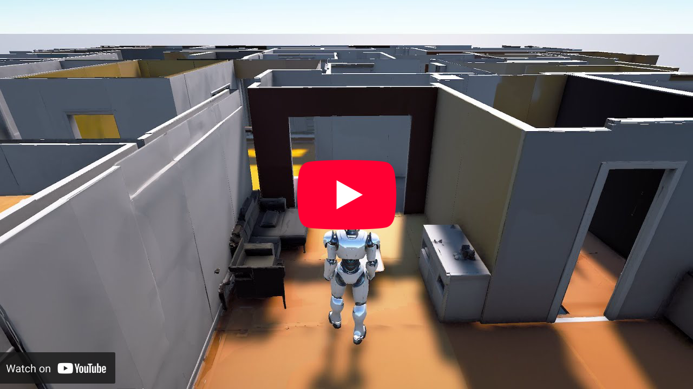

<div align="center">
  
  <h1>WorldGrow: Generating Infinite 3D World</h1>
  <h2>AAAI 2026 Oral</h2>

  <p>
    <a href="https://world-grow.github.io/">
      
    </a>
    <a href="https://arxiv.org/abs/2510.21682">
      
    </a>
    <a href="https://huggingface.co/UranusITS/WorldGrow">
      
    </a>
  </p>
</div>


<p align="center">
  <a href="https://scholar.google.com/citations?user=2dCJlg4AAAAJ">Sikuang Li</a><sup>1*</sup>,
  <a href="https://chensjtu.github.io/">Chen Yang</a><sup>2*</sup>,
  <a href="https://jaminfong.cn/">Jiemin Fang</a><sup>2✉‡</sup>,
  <a href="https://taoranyi.com/">Taoran Yi</a><sup>3</sup>,
  <a href="https://hustvl.github.io/Snap-Snap/">Jia Lu</a><sup>3</sup>,<br/>
  <a href="https://scholar.google.com/citations?user=JZIKCF0AAAAJ&hl=en">Jiazhong Cen</a><sup>1</sup>,
  <a href="http://lingxixie.com/Home.html">Lingxi Xie</a><sup>2</sup>,
  <a href="https://shenwei1231.github.io/">Wei Shen</a><sup>1</sup>,
  <a href="https://www.qitian1987.com/">Qi Tian</a><sup>2✉</sup>
</p>

<p align="center">
  <sup>1</sup>Shanghai Jiao Tong University 
  <sup>2</sup>Huawei 
  <sup>3</sup>Huazhong University of Science and Technology<br/>
  <sup>*</sup>Equal contribution   <sup>‡</sup>Project lead   <sup>✉</sup>Corresponding author
</p>

---

We propose **WorldGrow** — a generative method which creates **infinite EXPLICIT 3D** worlds, an alternative to the extensible, realistic, interactive world simulator.

<div align="center">
  <a href="https://www.youtube.com/watch?v=blVXMwGHQO4">
    
  </a>
</div>

## Overview

**WorldGrow** is a hierarchical framework for **infinite (open-ended) 3D world generation**. Starting from a single seed block, the system **grows** large environments via **block-wise synthesis** and **coarse-to-fine refinement**, producing coherent global layouts and detailed local geometry/appearance. The generated scenes are **walkable** and suitable for **navigation/planning** evaluation.

> If you use any part of this repository, please consider starring ⭐ the project and citing our paper.

## News

- **2025-11-14** — 🚀 The inference code and [pretrained weights](https://huggingface.co/UranusITS/WorldGrow) are now available.
- **2025-10-27** — 🚧 Paper released and repository initialized. The code is being prepared for public release; pretrained weights and full training/inference pipelines are planned.

## Getting Started

### Requirements

Clone the repository:

```bash
git clone --recurse-submodules https://github.com/world-grow/WorldGrow.git
```

Our code follows the environment setup of [TRELLIS](https://github.com/microsoft/TRELLIS). Please refer to the installation instructions in the repository to set up.

**Warning:** Original `cumm` and `spconv` packages are not suitable for our models. We provide modified versions in the `submodules/` folder and optimize the installation in `setup.sh`.

### Code Usage

We provide an example script `example_world_grow.py` to demonstrate how to generate large 3D worlds using pretrained models.

```python
import os
# os.environ['ATTN_BACKEND'] = 'xformers'   # Can be 'flash-attn' or 'xformers', default is 'flash-attn'
os.environ['SPCONV_ALGO'] = 'native'        # Can be 'native' or 'auto', default is 'auto'.
                                            # 'auto' is faster but will do benchmarking at the beginning.
                                            # Recommended to set to 'native' if run only once.

import imageio
from trellis.pipelines import WorldGrowPipeline
from trellis.utils import render_utils

# Load a pipeline from a model folder or a Hugging Face model hub.
pipeline = WorldGrowPipeline.from_pretrained("UranusITS/WorldGrow")
pipeline.cuda()

# Run the pipeline
world_size = (3, 3) # Specify the desired world size (in blocks)
outputs = pipeline.run(world_size=world_size)

# Render the outputs
r = 1.5 + max(world_size)
look_at = [0.25 * (world_size[0] - 1), 0.25 * (world_size[1] - 1), 0]
video = render_utils.render_video(outputs['gaussian'], r=r, look_at=look_at)['color']
imageio.mimsave("sample.mp4", video, fps=30)

outputs['mesh'].export("sample.glb")
outputs['gaussian'].save_ply("sample.ply")
```

After running the script, you will obtain a rendered video `sample.mp4`, a 3DGS point cloud `sample.ply`, and a reconstructed mesh `sample.glb` of the generated world.

You can modify the `world_size` variable to generate larger or smaller worlds. You may also adjust `formats=['gaussian']` to exclude mesh generation for faster inference.

## Results

- **Gallery**: diverse generated scenes at multiple scales.
- **Large-scale example**: a 19x39 indoor world (~1,800 m²) with reconstructed mesh and textured rendering.

Please visit the **[project page](https://world-grow.github.io/)** for more figures, videos, and metrics.

## License

TBD (to be finalized before full code release).

## Citation

```bibtex
@article{worldgrow2025,
  title   = {WorldGrow: Generating Infinite 3D World},
  author  = {Li, Sikuang and Yang, Chen and Fang, Jiemin and Yi, Taoran and Lu, Jia and Cen, Jiazhong and Xie, Lingxi and Shen, Wei and Tian, Qi},
  journal = {arXiv preprint arXiv:2510.21682},
  year    = {2025}
}
```

## Acknowledgements

We build our codebase upon [TRELLIS](https://github.com/microsoft/TRELLIS). Thanks to the authors for their open-source contributions.
